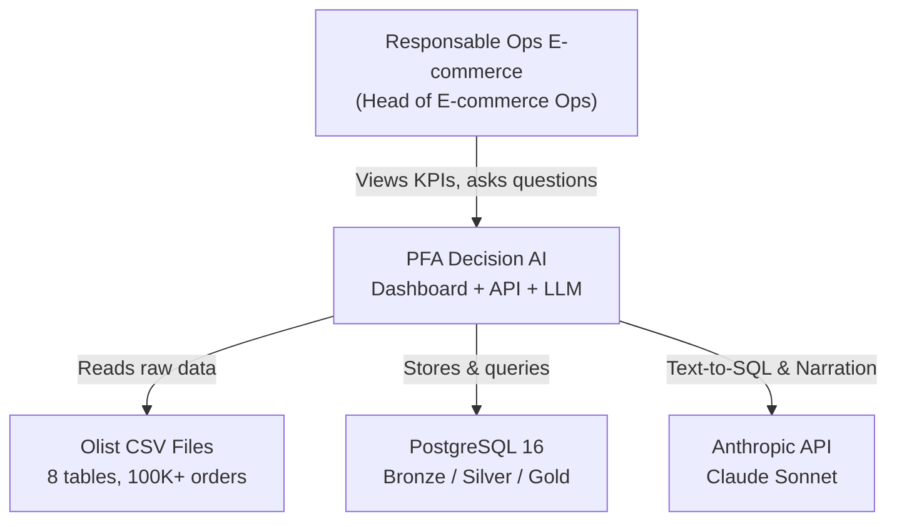
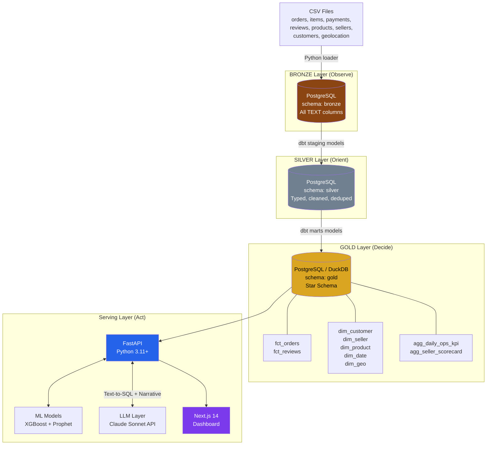
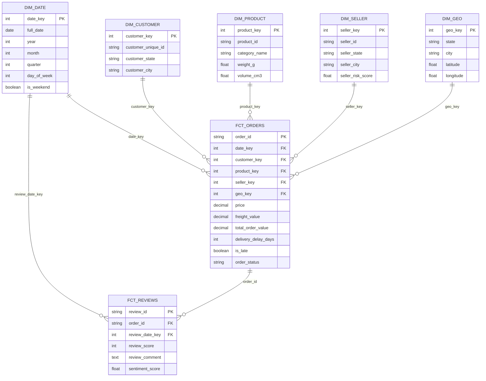
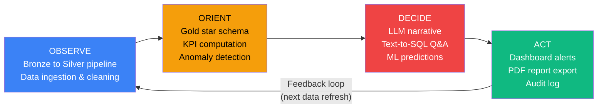
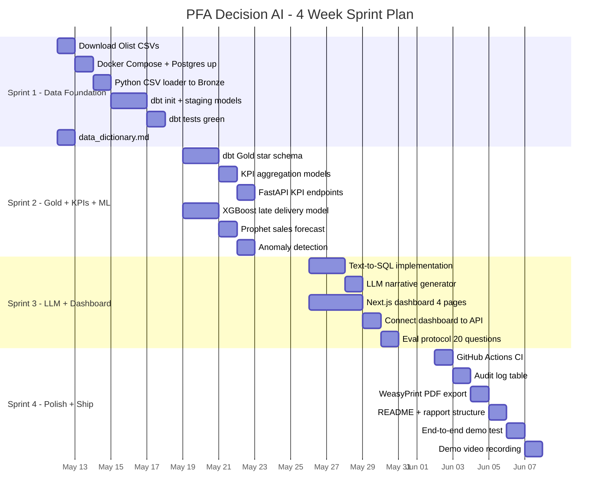

# PFA Decision AI — Master Plan: Critique, Architecture & 4-Week Sprint

> **Projet de Fin d'Année** — MGSI ENSAO 2026
> **Auteur :** Bouazzaoui Younes (Yunus)
> **Statut :** Prêt à coder (Vibe Coding avec Cursor + Antigravity)

---

## Part 1 — Honest Critique of the Pivot

### What You Did Right (Keep These)

| Decision | Why It's Smart |
|----------|---------------|
| **Mono-dataset Olist** | 8 relational tables = real SI. Forces star schema. Your classmate already validated feasibility |
| **Mono-persona** | "Head of E-commerce Ops" — crystal clear for jury and recruiters |
| **Cut SpringBoot** | Saves 3+ weeks of plumbing with zero demo value |
| **Cut RAG for Text-to-SQL** | The 2026 industry pattern. Snowflake Cortex, AWS Bedrock, Salesforce Horizon all do NL→SQL, not RAG on tabular data |
| **LLM as narrator, not calculator** | Your strongest architectural insight. Deterministic KPIs + LLM narration = zero hallucinated numbers |
| **CLAUDE.md + locked stack** | Already in your repo. This discipline alone prevents 80% of vibe-coding disasters |

### What's Still Wrong (Fix Before Coding)

| Issue | Severity | Fix |
|-------|----------|-----|
| **Your documents contradict each other** | 🔴 Critical | Doc 1 says "Azure Blob + ADF + Databricks". Doc 2 says "Path B: local Postgres + DuckDB". Doc 3 says "Snowflake free trial". Your actual repo has Docker Compose with local Postgres. **Your repo is right. Kill the cloud docs.** |
| **No `data_dictionary.md`** | 🔴 Critical | Without it, every AI agent will hallucinate column names. Create this file in `agent_docs/` before any other code |
| **No eval protocol** | 🟡 High | You mention "30 questions for Text-to-SQL benchmark" but haven't written them. The eval protocol should exist before Sprint 3 |
| **Missing `web/` and `ml/` directories** | 🟡 High | Your repo has `api/` and `dbt_project/` but no frontend or ML code yet |
| **Gantt timeline says 16 weeks, you said 4 weeks** | 🔴 Critical | Resolved below with a compressed 4-sprint / 4-week plan |
| **No `Makefile` targets for demo** | 🟡 Medium | `make up`, `make demo`, `make test` should all work. Your Makefile exists but is minimal |

### Comparison vs. Your Classmate's Lab Project

| Your Strength | Their Strength (You Must Copy) |
|--------------|-------------------------------|
| Decision Intelligence framing (OODA) | **Explicit ethical boundary statement** |
| Agentic AI vision (Text-to-SQL + narrative) | **Data governance section in report** |
| Modern stack (FastAPI, Next.js, dbt) | **Concrete, countable deliverables** |
| Cross-industry transferability | **"The platform does X, it does NOT do Y"** |

> [!IMPORTANT]
> Your repo already has the ethical boundary in `architecture.md` line 90-94. Good. But your **report** doesn't have it yet. Add a dedicated section.

---

## Part 2 — System Architecture (Final)

### C4 Context Diagram



### Container Diagram (Medallion Pipeline)



### Star Schema (Gold Layer)



### OODA Decision Loop



---

## Part 3 — Tech Stack (Locked)

| Layer | Technology | Why (1 sentence) |
|-------|-----------|-------------------|
| **DB** | PostgreSQL 16 (Docker) | ACID, free, standard for dbt, BCG interview staple |
| **OLAP** | DuckDB (in-process) | 100x faster than PG on aggregations, zero config |
| **Transform** | dbt Core | SQL-first, testable, generates lineage docs, industry standard |
| **Backend** | FastAPI + Pydantic v2 | Auto OpenAPI docs, async, strict validation |
| **Frontend** | Next.js 14 + Shadcn/UI + Recharts | SSR, TypeScript, modern React, beautiful charts |
| **ML** | XGBoost + Prophet + scikit-learn | Mature, interpretable, no GPU needed |
| **LLM** | Anthropic API (Claude Sonnet) | Best coding model, direct API (no LangChain overhead) |
| **Container** | Docker Compose | `make up` = full platform running |
| **CI/CD** | GitHub Actions | Free on public repos, runs dbt test + pytest |

### What's Excluded (and Why)

| Excluded | Reason | What You Say in Interview |
|----------|--------|--------------------------|
| SpringBoot | Zero ERP to integrate, adds 3 weeks for no demo value | "FastAPI covers the backend; Java competency shown separately via Salesforce PFE" |
| Kafka / Airflow | Batch weekly data, not streaming. 180K rows, not TB | "We chose batch + cron because our data refreshes weekly, not real-time" |
| ChromaDB / RAG | Data is structured SQL, not documents | "Text-to-SQL on a governed star schema is more accurate than RAG on tabular data" |
| Azure ADF / Databricks | 65% risk of non-delivery as solo student in 4 weeks | "Cloud is additive. Local-first ensures we always ship. Snowflake mirror is the cloud signal" |
| LangChain | Simple prompt→response pattern doesn't need abstraction | "Direct API calls give us full control and observability over token usage" |

---

## Part 4 — 4-Sprint / 4-Week Execution Plan

> [!CAUTION]
> This is a **4-week compressed sprint**, not 16 weeks. Each sprint = 1 week. You must vibe-code aggressively with Cursor/Antigravity. Cut scope ruthlessly if behind.

### Sprint Timeline



### Sprint Details

#### Sprint 1: Data Foundation (Week 1)

**Goal:** `make up` starts Postgres, CSVs are loaded, dbt staging models pass all tests.

| Day | Task | Deliverable | Exit Gate |
|-----|------|-------------|-----------|
| Mon | Download Olist CSVs + create `data_dictionary.md` | `data/raw/*.csv` + `agent_docs/data_dictionary.md` | All 8 CSVs present |
| Tue | Docker Compose up + `init-schemas.sql` (bronze/silver/gold) | `docker-compose up` works | `pg_isready` passes |
| Wed | Python loader script (idempotent, hash-based) | `scripts/load_bronze.py` | All 8 tables in `bronze.*` |
| Thu-Fri | dbt init + 8 staging models (`stg_*`) + YAML docs | `dbt_project/models/staging/` | `dbt run && dbt test` = 0 failures |
| Fri | Create `sources.yml` with column descriptions | `dbt_project/models/staging/_sources.yml` | Descriptions for all columns |

**Vibe Coding Prompt (Sprint 1):**
> "Read `@agent_docs/data_dictionary.md`. Create dbt staging models for all 8 Olist tables. Each model: cast columns to proper types, add `_loaded_at` metadata, handle nulls. Write a `_sources.yml` with full column descriptions. Add dbt tests: `not_null` on PKs, `unique` on PKs, `accepted_values` on `review_score` (1-5). Plan first, code after."

#### Sprint 2: Gold + KPIs + ML (Week 2)

**Goal:** Star schema materialized, 5 KPIs computed, 2 ML models trained, FastAPI serving.

| Day | Task | Deliverable | Exit Gate |
|-----|------|-------------|-----------|
| Mon | dbt Gold: `fct_orders`, `dim_customer`, `dim_seller`, `dim_product`, `dim_date`, `dim_geo` | `dbt_project/models/marts/` | `dbt run` green |
| Tue | dbt Gold: `fct_reviews`, `agg_daily_ops_kpi`, `agg_seller_scorecard` | Aggregation models | dbt tests green on all KPIs |
| Wed | FastAPI endpoints: `/kpi/otif`, `/kpi/aov`, `/kpi/nps`, `/kpi/cancellation` | `api/routers/kpi.py` | Swagger shows all endpoints |
| Thu | XGBoost classifier for `is_late` delivery prediction | `ml/late_delivery_model.py` | F1 >= 0.75 on test set |
| Fri | Prophet forecast (monthly orders by category) + IsolationForest anomalies | `ml/forecast.py`, `ml/anomaly.py` | MAPE <= 20% on holdout |

#### Sprint 3: LLM + Dashboard (Week 3)

**Goal:** Dashboard with 4 pages, Text-to-SQL works on 15+ questions, LLM narrative generates.

| Day | Task | Deliverable | Exit Gate |
|-----|------|-------------|-----------|
| Mon | Text-to-SQL: schema-aware prompt + 8 few-shot examples + sqlglot validation | `api/routers/ask.py` | Answers 10/20 test questions correctly |
| Tue | LLM narrative: receives KPIs, generates 3-paragraph business briefing | `api/routers/narrative.py` | Narrative mentions real numbers from Gold |
| Wed | Next.js: `/dashboard` page (KPI cards + 2 charts) | `web/app/dashboard/page.tsx` | Page renders with real data |
| Thu | Next.js: `/forecast` + `/anomalies` pages | `web/app/forecast/page.tsx` | Charts render Prophet output |
| Fri | Next.js: `/ask` page (chat-style Text-to-SQL) + wire all pages to API | `web/app/ask/page.tsx` | User types question, gets table + narrative |

#### Sprint 4: Polish + Ship (Week 4)

**Goal:** CI green, audit log working, PDF export, demo-ready, video recorded.

| Day | Task | Deliverable | Exit Gate |
|-----|------|-------------|-----------|
| Mon | GitHub Actions: `dbt test` + `pytest` + `ruff` on push | `.github/workflows/ci.yml` | Badge green on main |
| Tue | Audit log: `decisions` table + log every LLM query/response | `api/models/audit.py` | Queries logged with timestamp + tokens |
| Wed | WeasyPrint: PDF export of daily briefing (KPIs + narrative) | `api/routers/report.py` | PDF downloads from `/api/report` |
| Thu | README polish + rapport final structure (sections outline) | `README.md` + `reports/` | README has install + demo + architecture |
| Fri | End-to-end demo test + record 5-min demo video | `demo.mp4` | Full OODA loop demonstrated |

---

## Part 5 — Vibe Coding Strategy

### IDE Split

| Tool | When to Use | % of Time |
|------|------------|-----------|
| **Antigravity** | Multi-file scaffolding, dbt boilerplate, generating test fixtures, parallel tasks | 40% |
| **Cursor** | Next.js components (need visual preview), inline autocomplete, CSS tweaks | 35% |
| **Claude.ai chat** | Morning spec writing, architecture decisions, report drafting | 25% |

### Critical Files for Agent Context

These files **must exist before you start vibe-coding**. Without them, agents hallucinate:

| File | Purpose | Status |
|------|---------|--------|
| `CLAUDE.md` | Stack rules, naming conventions, forbidden tools | ✅ Done |
| `agent_docs/architecture.md` | C4 diagrams, OODA mapping | ✅ Done |
| `agent_docs/kpi_catalog.md` | KPI definitions + formulas | ✅ Done |
| `agent_docs/data_dictionary.md` | Column-by-column Olist schema | ❌ **CREATE FIRST** |
| `agent_docs/eval_protocol.md` | 20-30 test questions for Text-to-SQL | ❌ Create in Sprint 2 |
| `docker-compose.yml` | Service definitions | ✅ Done |

> [!WARNING]
> **The single most important file you're missing is `data_dictionary.md`.** Every agent (Cursor, Antigravity, Claude Code) will invent column names without it. Create this file on Day 1 before writing any code.

### Repo Structure (Target)

```text
pfa-decision-ai/
├── CLAUDE.md                         ✅ exists
├── Makefile                          ✅ exists (expand targets)
├── README.md                         ✅ exists (polish Sprint 4)
├── docker-compose.yml                ✅ exists
├── .github/workflows/ci.yml         ❌ Sprint 4
├── agent_docs/
│   ├── architecture.md               ✅ exists
│   ├── kpi_catalog.md                ✅ exists
│   ├── data_dictionary.md            ❌ DAY 1 PRIORITY
│   └── eval_protocol.md              ❌ Sprint 2
├── data/
│   └── raw/                          ❌ Download Olist CSVs
├── scripts/
│   ├── init-schemas.sql              ✅ exists
│   └── load_bronze.py                ❌ Sprint 1
├── dbt_project/
│   ├── dbt_project.yml               ✅ exists
│   ├── models/
│   │   ├── staging/                  ❌ Sprint 1
│   │   ├── intermediate/             ❌ Sprint 2 (if needed)
│   │   └── marts/                    ❌ Sprint 2
│   └── tests/                        ❌ Sprint 1-2
├── api/
│   ├── main.py                       ❌ Sprint 2
│   ├── routers/
│   │   ├── kpi.py                    ❌ Sprint 2
│   │   ├── ask.py                    ❌ Sprint 3
│   │   ├── narrative.py              ❌ Sprint 3
│   │   └── report.py                 ❌ Sprint 4
│   └── models/
│       └── audit.py                  ❌ Sprint 4
├── ml/
│   ├── late_delivery_model.py        ❌ Sprint 2
│   ├── forecast.py                   ❌ Sprint 2
│   └── anomaly.py                    ❌ Sprint 2
├── web/
│   ├── app/
│   │   ├── dashboard/page.tsx        ❌ Sprint 3
│   │   ├── forecast/page.tsx         ❌ Sprint 3
│   │   ├── anomalies/page.tsx        ❌ Sprint 3
│   │   └── ask/page.tsx              ❌ Sprint 3
│   └── components/                   ❌ Sprint 3
├── tests/                            ❌ Sprint 2-4
└── reports/                          ❌ Sprint 4
```

### Kill Switches (When to Cut Scope)

| Signal | Action |
|--------|--------|
| Sprint 1 takes > 8 days | Cut dbt tests to PKs only, skip column descriptions |
| XGBoost F1 < 0.60 after 4 hours | Use logistic regression baseline, move on |
| Text-to-SQL accuracy < 50% | Double the few-shot examples, switch to Opus for generation |
| Next.js takes > 3 days | Use Streamlit instead (ugly but ships) |
| Any tool (Antigravity, Cursor) wastes > 1 day | Kill it, use the other exclusively |

---

## Part 6 — Evaluation Metrics

| Component | Metric | Target | How to Measure |
|-----------|--------|--------|----------------|
| **Data pipeline** | dbt test pass rate | 100% critical, 80% total | `dbt test --store-failures` |
| **Late delivery ML** | F1-score (positive class) | >= 0.75 | Train/test split (time-based, not random) |
| **Sales forecast** | MAPE (30-day horizon) | <= 20% | Rolling backtest on last 3 months |
| **Anomaly detection** | Precision on 10 manual labels | >= 70% | Label 10 known anomaly days, check detection |
| **Text-to-SQL** | Execution accuracy on 20 questions | >= 75% (15/20) | Human-written NL questions + expected SQL |
| **Narrative quality** | 0 factual hallucinations in 10 samples | 0 errors | Cross-check LLM numbers vs Gold layer |
| **Dashboard** | Time-to-insight on 5 tasks | < 30 seconds each | Timed user test with 1 classmate |
| **System** | `make up` to first KPI displayed | < 3 minutes | Cold start timing |

---

## Part 7 — Final Verdict

### Project Score Card

| Dimension | V1 Report (Before Pivot) | V2 Repo (Current State) | After 4-Week Sprint |
|-----------|-------------------------|------------------------|-------------------|
| Scope clarity | 4/10 (3 datasets, 4 personas) | 8/10 (1 dataset, 1 persona) | 9/10 |
| Technical depth | 3/10 (listed tools, no code) | 6/10 (repo exists, Docker works) | 8/10 |
| Deliverability | 3/10 (65% failure risk) | 7/10 (local-first, 25% risk) | 8.5/10 |
| Consulting signal | 5/10 (buzzword inflation) | 7/10 (OODA + governance) | 9/10 (with eval framework) |
| Academic rigor | 4/10 (no metrics, no limits) | 6/10 (KPI catalog, ethical boundary) | 8/10 (with eval protocol) |

### The Non-Negotiable Rule

> **Ship > Perfect.** A working demo with 3 KPIs, 1 ML model, and a Text-to-SQL chat beats a beautiful architecture diagram with zero running code. Every time. In front of every jury.

### Start Now

Your repo already has `CLAUDE.md`, `docker-compose.yml`, `architecture.md`, and `kpi_catalog.md`. You are further ahead than 90% of PFA students at this stage.

**Day 1 action items:**
1. Download the 8 Olist CSVs into `data/raw/`
2. Create `agent_docs/data_dictionary.md` (column-by-column, copy from Kaggle)
3. Run `docker-compose up -d` and verify Postgres is healthy
4. Open Antigravity/Cursor, paste the Sprint 1 prompt, and start coding

**The clock starts now. Ship it, Yunus.** 🚀
